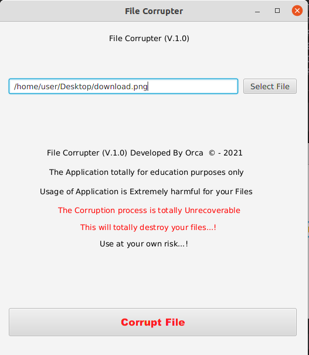
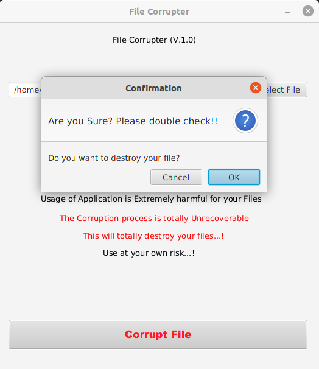
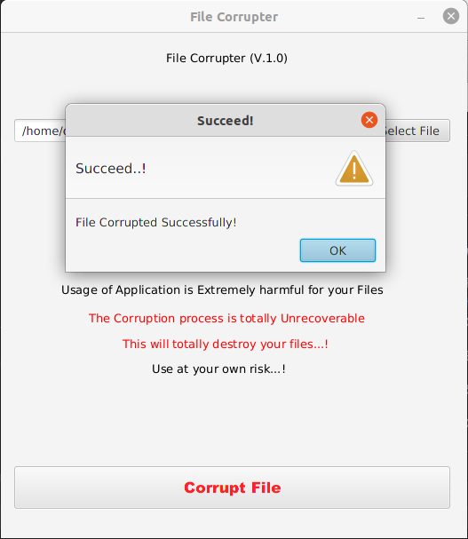

# File Corrupter

---
---

### Contents of this file
* Introduction
* User guide to use
* License

---

### Introduction

* A simple *Java FX Application* to study and demonstrate many Java and SE related stuff.
* This app can corrupt any file selected by changing its bytes.
* The process is unreversable.
* Please use at your own risk.
* Extremely for education purposes only.
* Don't use your important files via this app.
* Please double-check before use because this can lead permanently loss of your important files.

---
       (Main View)

---
      (Confirmation View)

 

---
      (Success View)

---
  

### How to use this repository?

1. First clone the repository.

   https://github.com/ChandimaHerath/FileCorruptor

2. Once cloned, open the repository from the IntelliJ IDEA

3. Build and Run!

4. Select file you need to corrupt(use an unwanted file).

5. Click "Corrupt File" button for corrupting.

---

### License

Copyright &copy; 2021 - present Chandima Herath. All rights reserved.

Licensed under the [MIT](LICENSE) license
